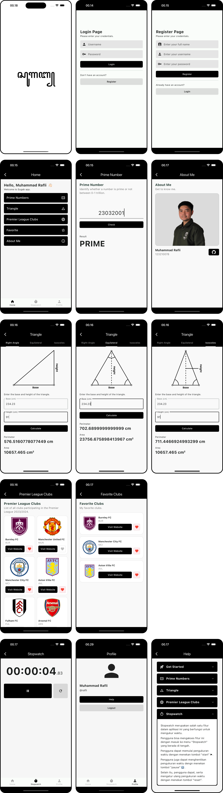

# tpm_tugas_4

Tugas TPM 4

## How to start

1. Nyalakan mysql server, buat db baru bernama tpm-tugas-4.sql
2. Masuk ke direktori /backend dengan perintah `cd backend/`
3. Import file db bernama tpm-tugas-4.sql pada direktori /backend
4. Jalankan perintah `npm i` untuk menginstall node dependencies
5. Isi file .env berdasarkan file .env.example pada direktori /backend
6. Jalankan web service (`npm run dev`) pada direktori /backend
7. Jalankan project flutter (`flutter run`) pada direktori root
8. 🏃🏻‍♂️

## Screenshot &nbsp; 📸

